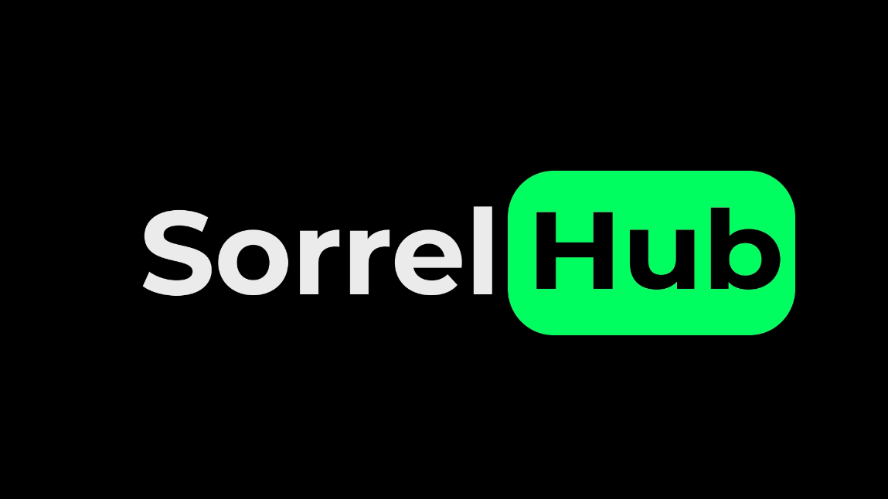
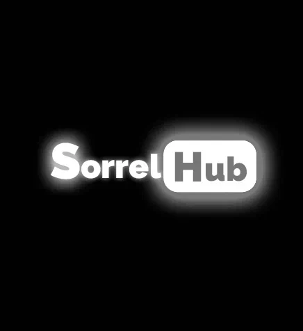
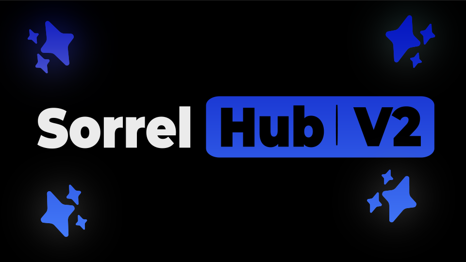

# Sorrel Hub Wiki

Public README project for Sorrel Hub history, products, branding, versions, and ecosystem notes.

Публичный README-проект про историю Sorrel Hub, продукты, бренд, версии и экосистему.

## Quick Links

| Language | Start | History | Products | Brand | Ownership | Versioning | Glossary |
| --- | --- | --- | --- | --- | --- | --- | --- |
| RU | [Начать](docs/ru/start-here.md) | [История](docs/ru/history.md) | [Продукты](docs/ru/products.md) | [Бренд](docs/ru/brand.md) | [Владение](docs/ru/ownership.md) | [Версии](docs/ru/versioning.md) | [Глоссарий](docs/ru/glossary.md) |
| EN | [Start](docs/en/start-here.md) | [History](docs/en/history.md) | [Products](docs/en/products.md) | [Brand](docs/en/brand.md) | [Ownership](docs/en/ownership.md) | [Versioning](docs/en/versioning.md) | [Glossary](docs/en/glossary.md) |

## RU

Sorrel Hub - dev-экосистема Winner и Lovey0x. Самый первый Sorrel Hub создавался не как script hub, а как Discord-сервер для Roblox-игры Winner `Щавель обби` и будущих плейсов.

Название родилось из двух частей:

- `sorrel` - щавель
- `hub` - место, где должны были собираться игроки, проекты и будущие плейсы

Только в период сентября-октября 2025 Sorrel Hub начал отходить от формата игрового Discord-сервера и становиться ближе к нынешней идее: Roblox scripts, web, backend, UI, AI и отдельные tools. Текущая эпоха называется `Sorrel Hub: NextGen`, но публичное имя постепенно ведется обратно к простому `Sorrel Hub`. `NextGen` лучше понимать как reboot/chapter, а не как отдельную компанию.

## EN

Sorrel Hub is a developer ecosystem by Winner and Lovey0x. The original Sorrel Hub did not start as a script hub. It started as a Discord server for Winner's Roblox game `Щавель обби` and future places.

The name came from two parts:

- `sorrel` - the plant
- `hub` - a place for players, projects, and future Roblox places

Only around September-October 2025 did Sorrel Hub move away from the game-server format and become closer to what it is now: Roblox scripts, web, backend, UI, AI, and separate tools. The current era is called `Sorrel Hub: NextGen`, but the public name is gradually moving back to `Sorrel Hub`. `NextGen` is better understood as a reboot/chapter, not a separate company.

## Current Status

- Official founding date: `2024-12-24`
- Old Sorrel Hub deletion date: `2025-06-01 00:00`, Yekaterinburg time
- Current era: `Sorrel Hub: NextGen`
- Current era creators: Winner and Lovey0x
- Pre-NextGen co-owner: Lox / `lox_228`
- Original purpose: Discord server for `Щавель обби` and future Roblox places
- Current purpose: web/dev ecosystem with Roblox scripting projects and tools
- Main domain: `sorrelhub.xyz`
- API domain: `api.sorrelhub.xyz`
- Sorrel AI domain: `aibot.sorrelhub.xyz`
- Possible future cabinet domain: `cabinet.sorrelhub.xyz`
- Main stack direction: React / Next.js for web projects

## Ownership

Sorrel Hub is owned by two founders:

- Winner, also known as Alfredo Swagger
- Lovey0x, also known as Lovey0x81nary

All decisions about the project, branding, infrastructure, and ecosystem are made exclusively by both owners. Sorrel Hub is not run by a public committee, a community vote, or a loose contributor group. Contributors can help, build, test, design, write, or suggest, but ownership and final direction stay with Winner and Lovey0x.

## Владение

Sorrel Hub принадлежит двум основателям:

- Winner, также известный как Alfredo Swagger
- Lovey0x, также известный как Lovey0x81nary

Все решения по проекту, бренду, инфраструктуре и экосистеме принимаются исключительно обоими владельцами. Sorrel Hub не управляется публичным комитетом, голосованием комьюнити или свободной группой контрибьюторов. Люди могут помогать, делать код, тестировать, рисовать, писать тексты или предлагать идеи, но владение и финальное направление остаются за Winner и Lovey0x.

## Logo Timeline

| Era | Preview | Notes |
| --- | --- | --- |
| Original 2024 |  | First known Sorrel Hub logo, older than one year. |
| Spring 2025 |  | Logo update made around spring 2025 in Photoshop. |
| English revival 2025 |  | Early English-audience revival before the current NextGen era. |
| NextGen current |  | Current Sorrel Hub: NextGen logo. |
| Unreleased v2 animation |  | Visual artifact from the unreleased Sorrel Hub v2 attempt. |

## Ecosystem

- `Sorrel Hub` - main brand and ecosystem.
- `WinWare` - Roblox/Luau project line focused around HvH, Visuals, and related modules.
- `LoveyWare` - Lovey0x's project line focused around bypass-oriented modules and related tooling.
- `TargetWare` - project that grew from predict tp and target esp.
- `Sorrel AI` - experimental AI bot in the Sorrel Hub ecosystem.
- `ExploitRPC` - open-source Windows Discord Rich Presence tool for supported Roblox injector activity.

## Repository Notes

This repository is documentation-first. It does not contain the website, backend, loader code, WinWare source, LoveyWare source, or Sorrel AI runtime.
