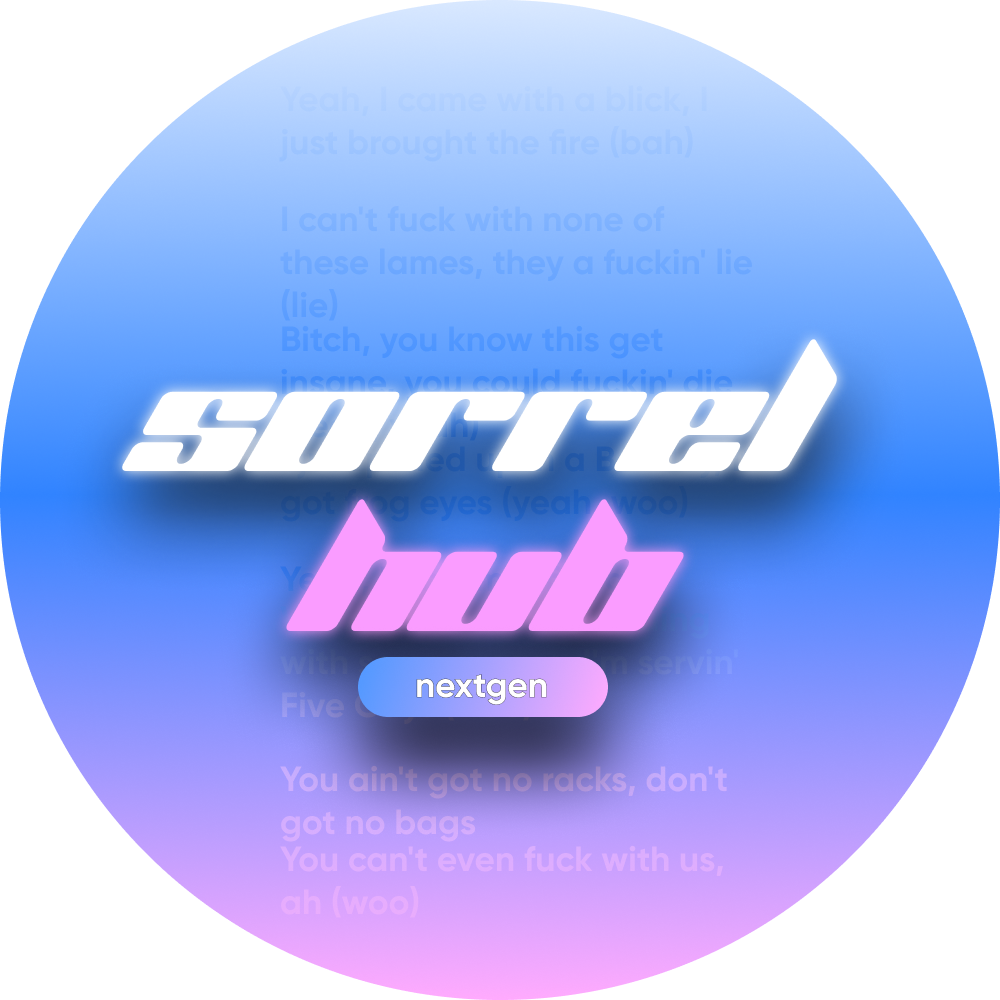
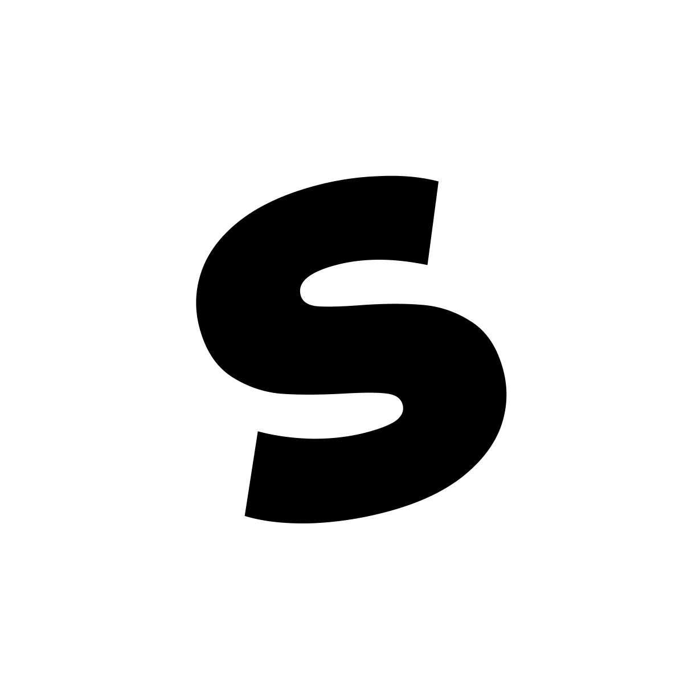
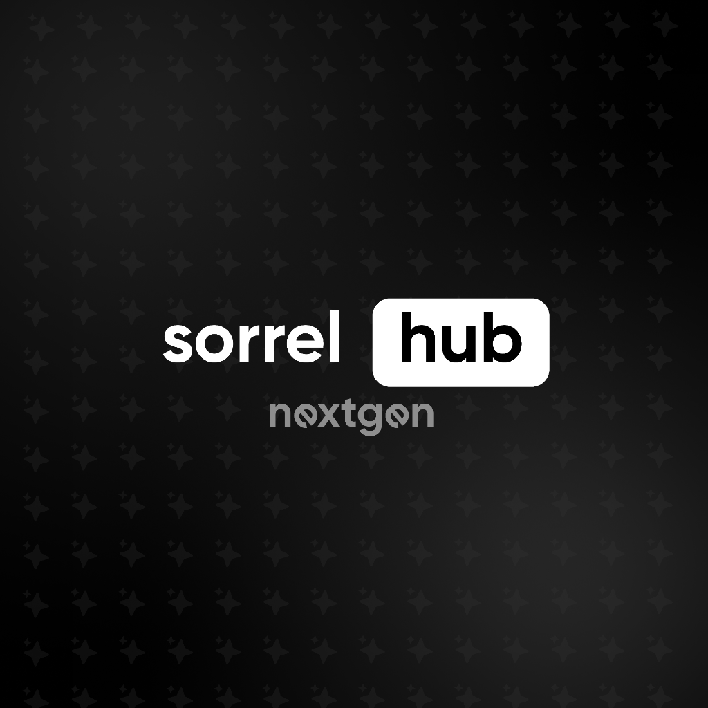
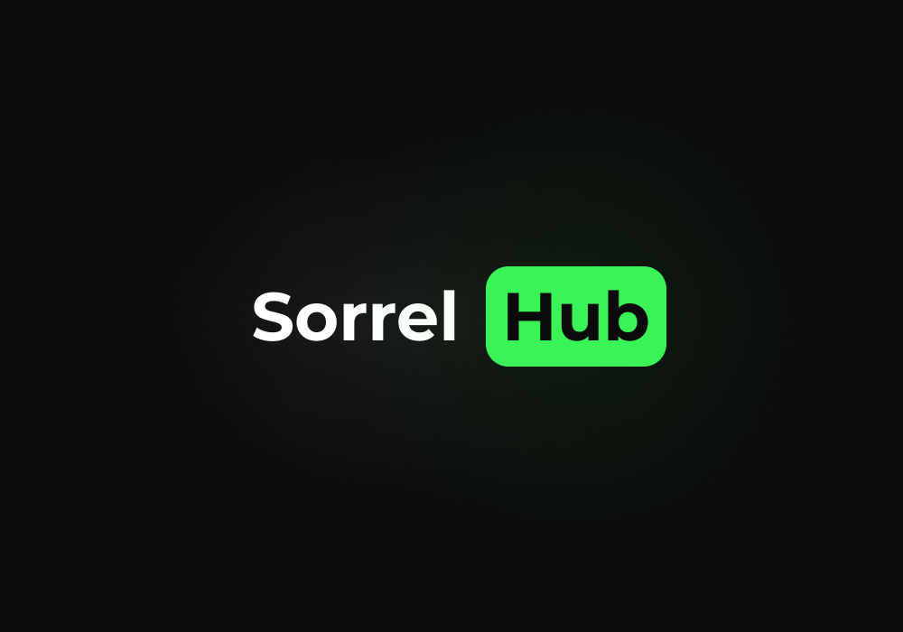
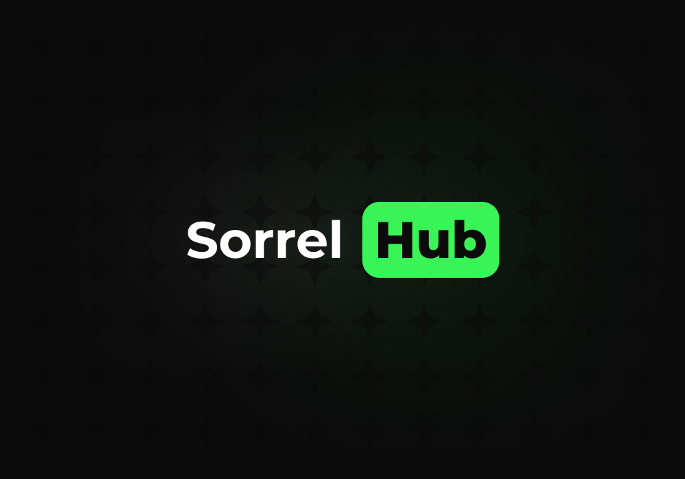
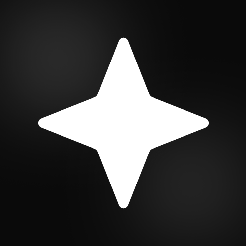
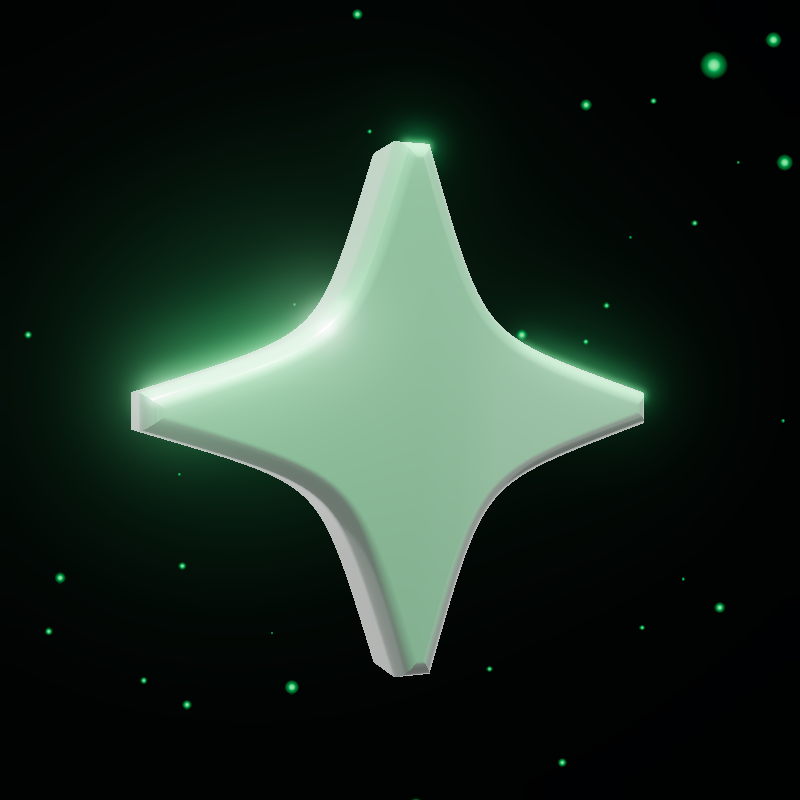
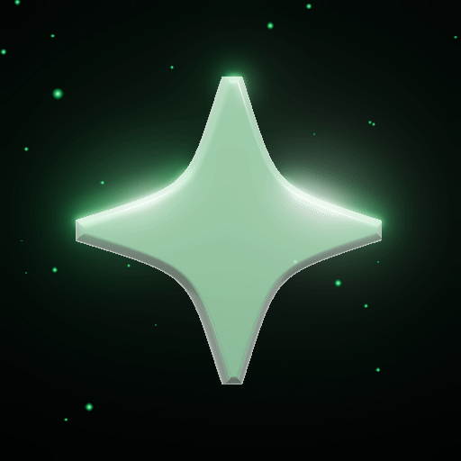

# Бренд

## Название

Основной бренд:

```txt
Sorrel Hub
```

Текущий публичный бренд после `2026-06-16 16:00 UTC+5`:

```txt
Sorrel Hub
```

`NextGen` - это название предыдущего reboot/chapter, а не текущее публичное позиционирование.

## Происхождение

Название родилось из двух частей:

- `sorrel` - щавель
- `hub` - место для игры, игроков, будущих плейсов и проектов

Рабочее объяснение:

```txt
Sorrel Hub started as a Discord server for Winner's Roblox game Щавель обби and later grew into a broader dev ecosystem.
```

Важная правка по смыслу: оригинальный Sorrel Hub был не script hub. Он был сервером вокруг игры `Щавель обби`. Script/web/dev направление стало основным уже позже, примерно в сентябре-октябре 2025.

## Логотипы

Вся история визуального стиля Sorrel Hub от истоков до текущего минимализма.

### Хронология и версии

1. **Самая первая версия логотипа (2024)** — старше года, истоки проекта.
   
2. **Photoshop-версия (Весна 2025)** — промежуточный вариант.
   
3. **English Revival / Early NextGen (Сентябрь-октябрь 2025)** — ранняя NextGen концепция.
   
4. **Самое первое лого NextGen** — ранняя итерация NextGen эры с градиентным кругом и текстом песни Yeat на фоне.
   
5. **Первая иконка NextGen** — ранняя иконка, предшествовавшая финальной звезде.
   
6. **Логотип NextGen** — чистая плоская версия NextGen на темном фоне со звездочками.
   
7. **Первая версия нынешнего логотипа** — плоский минималистичный дизайн с зеленой плашкой.
   
8. **Вторая версия нынешнего логотипа** — вариант текущего логотипа с фирменным паттерном со звездами на фоне.
   
9. **Текущая иконка (Конец NextGen / Настоящее время)** — минималистичная четырехконечная звезда (используется для Discord, иконки сайта и favicon).
   
10. **Текущее 3D-логотип (статичное)** — 3D-версия четырехконечной звезды зеленого оттенка с глянцевым покрытием и частицами на фоне.
    
11. **Текущее 3D-логотип (анимированное)** — анимированная GIF-версия (`sparkle.gif`) вращающейся 3D-звезды с мерцанием и блеском.
    

## Позиционирование

Коротко:

```txt
Sorrel Hub is a small dev ecosystem by Winner and Lovey0x.
```

Шире:

```txt
Sorrel Hub is a developer ecosystem for web tools, Roblox scripting projects, UI experiments, and AI-assisted utilities.
```
